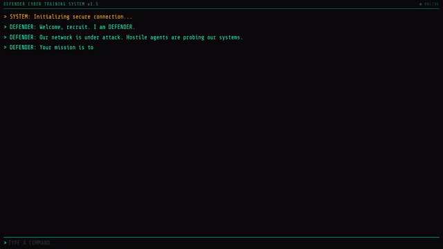

# Cyber Defence Trainer

> A browser-based cybersecurity training game powered by a JADE multi-agent system and ML threat models. Players defend against live attack waves by selecting the right countermeasure - and earn XP based on accuracy.

**Stack:** Java 17 · JADE 4.6 · Python 3 · scikit-learn · WebSocket · Vanilla JS

---

## Demo



## What It Is

Cyber Defence Trainer is a terminal-style game where the player defends a simulated network against three attack types - **phishing**, **brute force**, and **malware**. Each wave is driven by a dedicated attack agent whose threat confidence is scored by a real ML model trained on labelled security datasets.

A **DefenderAgent** evaluates the player's chosen countermove using a utility function and rates it as `SUPER_EFFECTIVE`, `NORMAL`, or `WEAK`. A **MonitoringScoringAgent** tracks XP across the session and issues a final performance rating. Players can type `HELP` at any time to get a reasoned recommendation from the defender.

The backend is a five-agent JADE platform bridged to the browser over WebSocket. The frontend is a single HTML file with no frameworks - a retro terminal aesthetic built in vanilla JS.

---

## Quick Start

```bash
# 1. Install Python dependencies (first time only)
python3 -m pip install scikit-learn joblib

# 2. Build backend, start WebSocket server, open browser
./start.sh
```

That's it. The script builds the Java backend with Maven, waits for WebSocket port 8887 to be ready, and opens `frontend/index.html` in your default browser. Press `Ctrl-C` to stop.

**Requirements:** Java 17+, Maven 3+, Python 3.8+

---

## Gameplay

### Commands

| Input | Effect |
|-------|--------|
| `READY` | Start a new wave (or restart after `FINISH`) |
| `PATCH` | Apply a software patch - effective against brute force |
| `SCAN` | Run a network scan - effective against malware |
| `BLOCK` | Block suspicious traffic - effective against phishing |
| `HINT` | Get a short recommendation (partial XP penalty) |
| `HELP` | Get a full reasoned recommendation from the DefenderAgent |
| `NEXT` | Proceed after a result |
| `FINISH` | End the session and view your summary |

### XP System

XP starts at **500**. Each wave awards points based on move effectiveness and whether help was used:

| Move Result | No Help | Help Used |
|-------------|---------|-----------|
| SUPER_EFFECTIVE | +150 XP | +25 XP |
| NORMAL | +100 XP | +25 XP |
| WEAK | retry (no XP) | retry (+25 XP) |

A **wrong move** costs XP proportional to threat confidence:

```
deduction = max(1, floor(totalXP × threat_confidence))
```

Higher-confidence threats punish mistakes more severely.

### Performance Ratings

| XP at End | Rating |
|-----------|--------|
| 0 – 300 | RECRUIT |
| 301 – 600 | ANALYST |
| 601 – 900 | SPECIALIST |
| 901+ | DEFENDER |

---

## Architecture


The system runs five JADE agents on a shared platform, connected to the browser via a WebSocket bridge:

| Agent | Responsibility |
|-------|---------------|
| `PhishingAttackAgent` | Runs `predict_phishing.py` at startup; samples threat confidence each wave |
| `BruteForceAgent` | Runs `predict_bruteforce.py`; same pattern |
| `MalwarePropagationAgent` | Runs `predict_malware.py`; same pattern |
| `DefenderAgent` | Utility-based move evaluator: `U(move) = E(threat_reduction) - C(move) - P(false_positive)`; handles HELP/HINT |
| `MonitoringScoringAgent` | Owns all XP state, accuracy tracking, session management |

**Startup flow:** `Main.java` starts `GameStateBridge` (WebSocket server on `:8887`), then launches all five agents. On browser connect, the bridge spawns a `GameFlowController` thread that runs the game loop - blocking on a queue for player input, then coordinating agent calls and broadcasting results.

**ML models:** Each attack agent runs a Python subprocess at startup to load 5 calibrated confidence values from a `.pkl` model (scikit-learn). These pre-sampled values are cycled through during gameplay. If a model is missing, the agent falls back to 0.0% confidence and the game continues.

Architecture diagrams are in [`docs/`](docs/).

---

## Tech Stack

| Component | Technology | Notes |
|-----------|-----------|-------|
| Agent platform | JADE 4.6 | FIPA-compliant MAS framework |
| Backend language | Java 17 | Maven build |
| WebSocket server | Java-WebSocket 1.5.3 | Bridge between agents and browser |
| ML models | scikit-learn (Python 3) | Random Forest classifiers, `.pkl` format |
| Frontend | Vanilla JS / HTML / CSS | No frameworks; single file |
| Font | Share Tech Mono | Terminal aesthetic |

---

## Project Structure

```
.
├── backend/
│   ├── src/main/java/
│   │   ├── Main.java                        # Entry point
│   │   ├── agents/
│   │   │   ├── PhishingAttackAgent.java
│   │   │   ├── BruteForceAgent.java
│   │   │   ├── MalwarePropagationAgent.java
│   │   │   ├── DefenderAgent.java           # Utility-based evaluator + HELP
│   │   │   └── MonitoringScoringAgent.java  # XP state + session management
│   │   ├── bridge/
│   │   │   └── GameStateBridge.java         # WebSocket server + shared state
│   │   └── game/
│   │       ├── GameFlowController.java      # Game loop (one per client)
│   │       └── GameSummary.java
│   ├── predict_phishing.py                  # ML inference scripts
│   ├── predict_bruteforce.py
│   ├── predict_malware.py
│   └── pom.xml
├── frontend/
│   └── index.html                           # Complete frontend (single file)
├── docs/                                    # Architecture diagrams
└── start.sh                                 # One-command launcher
```

---

## Development

```bash
mvn -f backend/pom.xml compile   # Compile check
mvn -f backend/pom.xml package   # Build JAR
```

---

## Authors

| Name | GitHub |
|------|--------|
| Hunter Antal | [@hunterAntal](https://github.com/hunterAntal) |
| Felix Ikokwu | [@fikokwu](https://github.com/fikokwu) |
| Lois | - |
